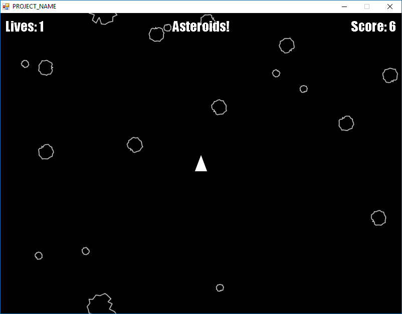

Protogame "Asteroids" Template
================================

This template implements the game of Asteroids in Protogame.  It covers the following topics:

- How to create componentized entities
- How to manage, add and remove entities and components
- How to restart worlds
- How to load and render textures
- How to detect 2D per-pixel collisions

